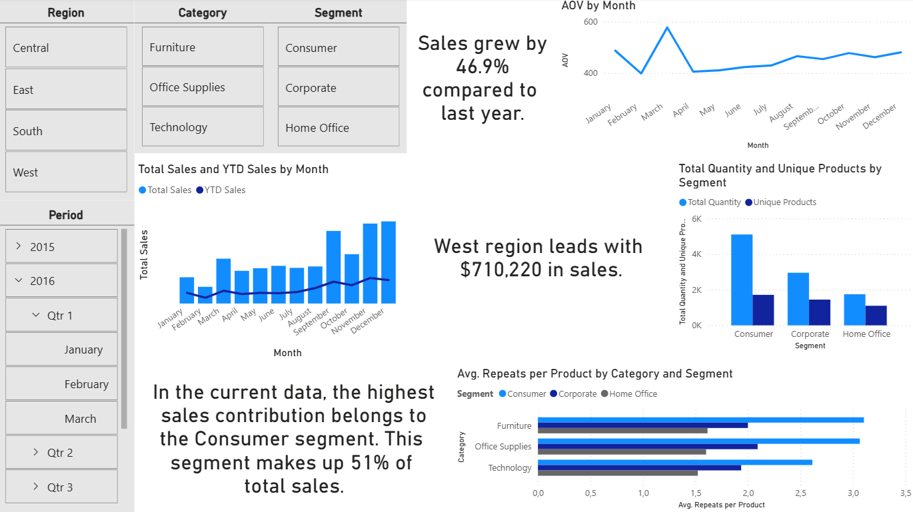
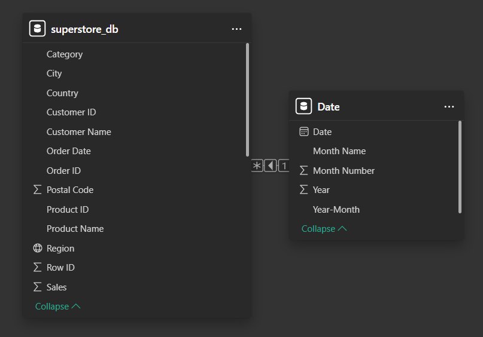
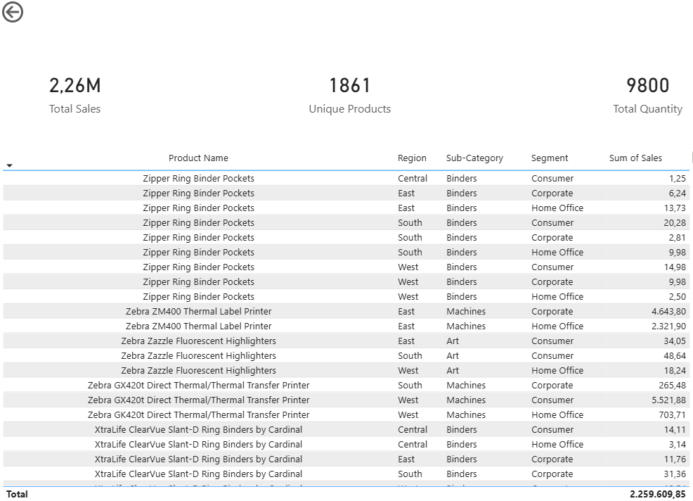

🌟 Power BI Sales Performance Dashboard

This project presents an end-to-end Sales Performance Dashboard built in Power BI.
Its primary purpose is to deliver fast, actionable, and visually intuitive insights that support data-driven decision making across product, customer, and regional performance areas.

The dashboard brings together core sales metrics, behavioral trends, and time-intelligence calculations into a single analytical experience — providing clear visibility over operational performance, growth opportunities, and business patterns.

Main analytical view showcasing sales KPIs, regional insights, segment performance, and trend analysis.

🔑 Key Performance Indicators (KPIs)

The dashboard tracks a comprehensive set of KPIs to evaluate product, customer, and regional performance:

| KPI                           | Description                                                 |
| ----------------------------- | ----------------------------------------------------------- |
| **AOV (Average Order Value)** | Average revenue generated per order                         |
| **Avg. Repeats per Product**  | Average number of repeat purchases per product              |
| **Unique Products**           | Number of distinct products sold within the selected period |
| **Total Sales**               | Overall revenue generated                                   |
| **Total Quantity**            | Total number of units sold                                  |
| **Sales YoY Insight**         | Year-over-year sales change percentage                      |
| **Top Region Insight**        | Region contributing the highest sales                       |
| **Top Segment Insight**       | Best-performing customer segment                            |
| **YoY Sales Growth**          | Annual growth rate in sales                                 |
| **YoY Target**                | Performance progress toward yearly sales target             |
| **YTD Sales**                 | Year-to-date revenue                                        |

These KPIs are fully visualized within the Power BI report; here they are summarized for reference.

🏗️ Data Model & Architecture

A clean, scalable, and optimized data model was designed to support fast performance and accurate time-based calculations.

📁 1. Date Dimension Table
A dedicated Date Dimension Table was built to enable advanced Time Intelligence measures.
Key design decisions:
Order Date was separated into a structured Date table
A Many-to-One relationship (Fact → Date) forms a Star Schema
DateKey was used to establish a clean relational structure
Functions such as TOTALYTD, SAMEPERIODLASTYEAR, and DATEADD operate accurately due to this structure

📁 2. Drill-Through Navigation (Category → Product Level)

The dashboard incorporates an intuitive drill-through experience that allows users to jump from category-level summaries to detailed product insights.
The Product Details page includes:
Product-specific KPIs
Product metadata
Historical sales trends
Context preserved through drill-through filters
This creates a seamless analytical flow — from broad overview to granular decision-ready detail.

🔍 Highlighted Insights

The report generates several meaningful insights, including:
Certain product categories show significantly higher contribution to total revenue
The top-performing region shifts by period, allowing dynamic operational analysis
Customer segment performance reveals clear purchasing behavior patterns
YoY Growth metrics provide transparent visibility into annual performance trends
YTD metrics support real-time tracking of progress toward strategic targets
These insights help guide strategic planning, product decisions, and resource allocation.

📂 Files Included

| File                            | Description                                   |
| ------------------------------- | --------------------------------------------- |
| **retail_sales_dashboard.pbix** | Main Power BI report file                     |
| **Superstore.xlsx**             | Raw dataset used in the model                 |
| **README.md**                   | Documentation file                            |
| **/screenshots**                | Folder containing dashboard and model visuals |
